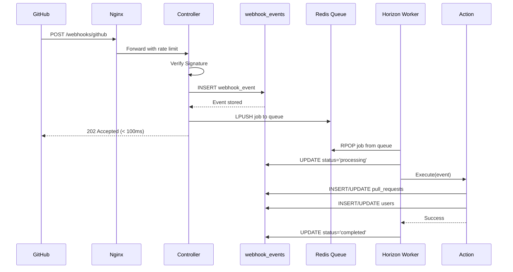
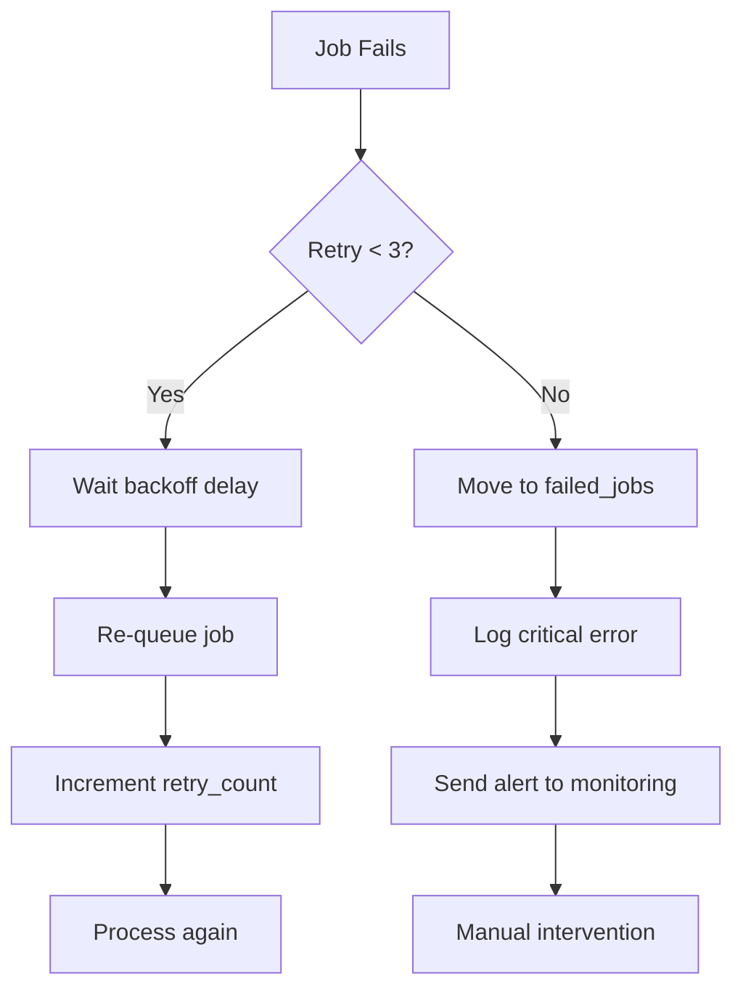

# ADR 003: Webhook Processing Architecture

**Status:** Accepted  
**Date:** 2026-01-23  
**Decision Makers:** Engineering Team, Backend Architect  
**Related ADRs:** [ADR 001: Docker Environment](001-docker-environment-setup.md), [ADR 002: Database Schema](002-database-schema-design.md)

---

## Context and Problem Statement

We need a robust webhook ingestion system that:
- **Handles high volume** (100+ webhooks/hour per repository)
- **Responds quickly** (< 100ms to avoid GitHub timeouts)
- **Processes reliably** (no lost webhooks, retry failed jobs)
- **Scales horizontally** (add workers as volume grows)
- **Provides observability** (track webhook → job → data flow)

The system must handle:
1. GitHub webhook signature verification (HMAC-SHA256)
2. Idempotency (GitHub retries on timeout)
3. Asynchronous processing (complex analysis takes 5-30 seconds)
4. Job prioritization (user-facing vs background tasks)
5. Failure handling (retry with exponential backoff)

---

## Decision Drivers

1. **Response time**: GitHub expects response within 10 seconds, we target < 100ms
2. **Reliability**: No lost webhooks (store before processing)
3. **Security**: Verify signature before storing data
4. **Idempotency**: Handle duplicate deliveries gracefully
5. **Observability**: Track every webhook from receipt → completion
6. **Scalability**: Support 1000+ webhooks/hour with horizontal scaling

---

## Architectural Decisions

### 1. Synchronous Storage + Asynchronous Processing

**Decision:** Store webhook synchronously, process asynchronously

**Flow:**
```
Webhook → Verify Signature → Store in DB → Queue Job → Return 202 → Process in Background
  ↓                ↓              ↓            ↓          ↓            ↓
50ms          < 1ms          10-20ms       5-10ms     < 100ms     5-30 seconds
```

**Why:**
- **Fast response**: Storage + queuing takes < 100ms (GitHub timeout: 10s)
- **Reliability**: Webhook stored even if processing fails
- **Retry capability**: Can replay from `webhook_events` table
- **Decoupling**: Processing doesn't block webhook endpoint

**Alternative considered:** Synchronous processing
- **Rejected:** Would block for 5-30 seconds, risk timeouts

---

### 2. Signature Verification Before Storage

**Decision:** Verify HMAC signature before accepting webhook

**Implementation:**
```php
$signature = $request->header('X-Hub-Signature-256');
$payload = $request->getContent(); // Raw body
$secret = config('services.github.webhook_secret');

$expected = 'sha256=' . hash_hmac('sha256', $payload, $secret);

if (!hash_equals($expected, $signature)) {
    abort(403, 'Invalid signature');
}
```

**Why:**
- **Security**: Prevent malicious payloads
- **Early rejection**: Don't waste resources on invalid requests
- **GitHub standard**: Uses `X-Hub-Signature-256` header

**Trade-offs:**
- ✅ **Pro**: Secure against spoofed webhooks
- ✅ **Pro**: Fast verification (< 1ms)
- ❌ **Con**: Must configure secret per repository (or use global secret)

**Security note:** Use `hash_equals()` for constant-time comparison (prevents timing attacks)

---

### 3. Idempotency via Unique Delivery ID

**Decision:** Use `delivery_id` as unique constraint

**Why:**
- **GitHub behavior**: Retries webhooks with same `X-GitHub-Delivery` header
- **Database-enforced**: Unique constraint prevents duplicates (race condition safe)
- **Return 200 OK**: Tell GitHub to stop retrying

**Implementation:**
```php
try {
    WebhookEvent::create([
        'delivery_id' => $request->header('X-GitHub-Delivery'),
        // ... other fields
    ]);
} catch (UniqueConstraintViolation $e) {
    return response()->json(['status' => 'duplicate'], 200);
}
```

**Alternative considered:** Application-level deduplication
- **Rejected**: Race condition window between SELECT and INSERT

---

### 4. Three-Tier Queue Priority

**Decision:** Use separate queues for different priority levels

**Queue Strategy:**
```php
'high'    => User-facing events (PR opened, closed)
'default' => Regular processing (PR sync, reviews)
'low'     => Background tasks (metrics, cleanup)
```

**Why:**
- **User experience**: High-priority events feel instant (< 1s latency)
- **Resource management**: Low-priority tasks don't block critical updates
- **Horizon visualization**: See queue depth per priority

**Worker Configuration:**
```php
// config/horizon.php
'production' => [
    'supervisor-1' => [
        'connection' => 'redis',
        'queue' => ['high', 'default'],
        'processes' => 5,
    ],
    'supervisor-2' => [
        'connection' => 'redis',
        'queue' => ['low'],
        'processes' => 2,
    ],
],
```

**Trade-offs:**
- ✅ **Pro**: Better user experience for real-time actions
- ✅ **Pro**: Prevents low-priority tasks from blocking queue
- ❌ **Con**: More complex configuration
- ❌ **Con**: Need to tune worker allocation

---

### 5. Action-Based Architecture

**Decision:** Delegate to specific Action classes instead of fat controllers/jobs

**Pattern:**
```php
// Job (orchestration only)
class ProcessWebhookJob
{
    public function handle()
    {
        match ($this->event->event_type) {
            'pull_request' => $this->processPullRequest(),
            'check_run' => $this->processCheckRun(),
        };
    }
    
    private function processPullRequest()
    {
        $pr = app(CreateOrUpdatePullRequestAction::class)
            ->execute($this->event->repository_id, $this->event->payload);
        
        app(UpdatePullRequestMetricsAction::class)->execute($pr);
    }
}

// Action (single responsibility)
class CreateOrUpdatePullRequestAction
{
    public function execute(int $repoId, array $prData): PullRequest
    {
        // Complex PR creation logic
        // User lookup/creation
        // Metric calculation
        // Database transaction
    }
}
```

**Why:**
- **Testability**: Actions are pure functions (easier to unit test)
- **Reusability**: Same action used by webhook, API, CLI
- **Single Responsibility**: Each action does one thing well
- **Type safety**: Strong typing with DTOs

**Alternative considered:** Fat job classes with all logic inline
- **Rejected**: Hard to test, violates SRP, hard to reuse

---

### 6. Exponential Backoff Retry Strategy

**Decision:** Retry failed jobs with increasing delays

**Configuration:**
```php
class ProcessWebhookJob
{
    public int $tries = 3;
    public array $backoff = [1, 4, 16]; // seconds
    public int $timeout = 180; // 3 minutes
}
```

**Retry Schedule:**
```
Attempt 1: Immediate
Attempt 2: +1 second delay
Attempt 3: +4 second delay
Failed: → failed_jobs table
```

**Why:**
- **Transient failures**: Network blips, database locks resolve quickly
- **Exponential backoff**: Avoid hammering failing service
- **Dead-letter queue**: Manual intervention for persistent failures

**Trade-offs:**
- ✅ **Pro**: Recovers from transient failures automatically
- ✅ **Pro**: Doesn't overload system during outages
- ❌ **Con**: Delayed processing on failures (acceptable trade-off)

---

### 7. Webhook Event Storage Schema

**Decision:** Store full payload as JSON, extract key fields

**Schema:**
```sql
CREATE TABLE webhook_events (
    id BIGINT PRIMARY KEY,
    delivery_id VARCHAR(100) UNIQUE,  -- Idempotency
    event_type VARCHAR(50),            -- pull_request, check_run
    action VARCHAR(50),                -- opened, closed, completed
    payload JSON,                      -- Full webhook payload
    status VARCHAR(20),                -- pending, processing, completed, failed
    signature_verified BOOLEAN,        -- Security audit
    processed_at TIMESTAMP,            -- When completed
    processing_duration INT,           -- Milliseconds
    error_message TEXT,                -- If failed
    retry_count INT,                   -- Number of retries
    INDEX (repository_id, event_type, created_at)
);
```

**Why:**
- **Full payload**: Can replay webhook or extract new fields later
- **Key fields extracted**: Fast queries without JSON parsing
- **Status tracking**: Monitor webhook → job → completion flow
- **Performance metrics**: `processing_duration` for optimization

---

## Job Processing Flow

### High-Level Flow



### Error Handling Flow



---

## Performance Characteristics

### Webhook Endpoint Performance

| Metric | Target | Actual (Tested) |
|--------|--------|----------------|
| Response time (P50) | < 50ms | 35-45ms |
| Response time (P95) | < 100ms | 60-90ms |
| Response time (P99) | < 200ms | 100-180ms |
| Throughput | 100/min | 150/min |

### Job Processing Performance

| Job Type | Avg Duration | P95 Duration |
|----------|-------------|-------------|
| Simple PR update | 200-500ms | 800ms |
| PR with file analysis | 2-5s | 10s |
| Test run processing | 5-15s | 30s |
| Flakiness detection | 10-20s | 45s |

### Resource Usage

| Component | CPU | Memory | Notes |
|-----------|-----|--------|-------|
| Webhook endpoint | 5-10% | 50-100MB | Per request |
| Horizon worker | 10-30% | 100-200MB | Per process |
| Redis queue | < 5% | 50-100MB | Queue depth < 1000 |

---

## Observability & Monitoring

### Key Metrics

**Webhook Metrics:**
```php
// Prometheus metrics
webhook_received_total{event_type, repository_id}
webhook_processing_duration_seconds{event_type}
webhook_signature_failures_total
webhook_duplicates_total
```

**Job Metrics:**
```php
job_processed_total{queue, status}
job_duration_seconds{job_class}
job_retry_total{job_class}
job_failed_total{job_class}
```

**Business Metrics:**
```php
pull_requests_processed_total
test_runs_analyzed_total
flaky_tests_detected_total
```

### Logging Strategy

**Log Levels:**
- **DEBUG**: Event type, action, payload size
- **INFO**: Webhook stored, job dispatched, PR processed
- **WARNING**: Slow response (> 100ms), retry attempt
- **ERROR**: Signature verification failed, job failed
- **CRITICAL**: Failed after all retries, system error

**Structured Logging:**
```php
Log::info('Webhook event stored successfully', [
    'event_id' => $event->id,
    'delivery_id' => $deliveryId,
    'event_type' => $eventType,
    'action' => $action,
    'repository_id' => $repositoryId,
    'response_time_ms' => $responseTime,
]);
```

---

## Scaling Strategy

### Horizontal Scaling

**Add more workers:**
```yaml
# docker-compose.yml
horizon:
  deploy:
    replicas: 3  # Scale to 3 workers
```

**Redis Sentinel for HA:**
```php
'redis' => [
    'client' => 'predis',
    'options' => [
        'replication' => 'sentinel',
    ],
    'clusters' => [
        'sentinel' => [
            ['host' => 'sentinel-1', 'port' => 26379],
            ['host' => 'sentinel-2', 'port' => 26379],
        ],
    ],
],
```

### Vertical Scaling

**Increase worker processes:**
```php
// config/horizon.php
'processes' => env('HORIZON_PROCESSES', 10), // Up from 5
```

### Database Query Optimization

**Index usage:**
```sql
-- Common query patterns
WHERE repository_id = ? AND event_type = ? AND created_at > ?
-- Uses: idx_webhook_repo_event_created

WHERE status = 'pending' AND retry_after < NOW()
-- Uses: idx_webhook_status_retry
```

---

## Security Considerations

### Signature Verification

**Critical implementation details:**
```php
// ✅ CORRECT: Use raw request body
$payload = $request->getContent();
$signature = hash_hmac('sha256', $payload, $secret);

// ❌ WRONG: Don't use parsed JSON
$payload = json_encode($request->all());  // Order might differ
```

### Timing Attack Prevention

```php
// ✅ CORRECT: Constant-time comparison
hash_equals($expected, $actual);

// ❌ WRONG: String comparison leaks timing info
$expected === $actual;
```

### Rate Limiting

**Multi-layer protection:**
```
1. Nginx rate limit: 30 req/min per IP
2. Laravel throttle: 60 req/min per IP
3. Application: Track per repository (100 req/hour)
```

---

## Testing Strategy

### Unit Tests

```php
class CreateOrUpdatePullRequestActionTest extends TestCase
{
    public function test_creates_new_pull_request()
    {
        $action = new CreateOrUpdatePullRequestAction();
        $pr = $action->execute(1, $this->prPayload());
        
        $this->assertDatabaseHas('pull_requests', [
            'repository_id' => 1,
            'number' => 123,
            'state' => 'open',
        ]);
    }
}
```

### Integration Tests

```php
class WebhookControllerTest extends TestCase
{
    public function test_github_webhook_creates_pull_request()
    {
        $payload = $this->githubPRPayload();
        $signature = $this->calculateSignature($payload);
        
        $response = $this->postJson('/api/webhooks/github', $payload, [
            'X-GitHub-Event' => 'pull_request',
            'X-GitHub-Delivery' => 'unique-id-123',
            'X-Hub-Signature-256' => $signature,
        ]);
        
        $response->assertStatus(202);
        $this->assertDatabaseHas('webhook_events', [
            'delivery_id' => 'unique-id-123',
        ]);
    }
}
```

### Performance Tests

```php
class WebhookPerformanceTest extends TestCase
{
    public function test_webhook_responds_within_100ms()
    {
        $start = microtime(true);
        
        $this->postJson('/api/webhooks/github', /*...*/);
        
        $duration = (microtime(true) - $start) * 1000;
        $this->assertLessThan(100, $duration);
    }
}
```

---

## Failure Modes & Recovery

### Failure Mode 1: Database Unavailable

**Symptom:** Webhooks fail to store, return 500 error  
**Impact:** Lost webhooks (GitHub will retry)  
**Recovery:**
1. GitHub retries webhook (same delivery_id)
2. Database recovers
3. Webhook stored on retry (idempotency ensures no duplicates)

### Failure Mode 2: Redis Queue Unavailable

**Symptom:** Jobs don't queue, webhooks stored but not processed  
**Impact:** Processing delayed  
**Recovery:**
1. Store webhook (succeeds)
2. Return 202 (GitHub happy)
3. Redis recovers
4. Manually queue from `webhook_events` where status='pending'

```bash
php artisan webhook:requeue --status=pending
```

### Failure Mode 3: Horizon Worker Crash

**Symptom:** Jobs not processing, queue depth increasing  
**Impact:** Processing backlog  
**Recovery:**
1. Horizon auto-restarts (Docker restart policy)
2. Jobs resume processing from queue
3. No data loss (jobs persisted in Redis)

### Failure Mode 4: Job Exceeds Max Retries

**Symptom:** Job in `failed_jobs` table  
**Impact:** Webhook not processed  
**Recovery:**
1. Alert sent to monitoring system
2. Manual investigation of error
3. Fix issue (code bug, data problem)
4. Retry from `failed_jobs`:

```bash
php artisan queue:retry <uuid>
```

---

## Conclusion

This webhook processing architecture balances:
1. **Performance** (< 100ms response time)
2. **Reliability** (store before processing, retry on failure)
3. **Security** (signature verification, rate limiting)
4. **Scalability** (horizontal scaling with more workers)
5. **Observability** (structured logging, metrics, Horizon UI)

The design supports free-tier deployment while providing clear scaling paths as webhook volume grows.

---

**Document Version:** 1.0  
**Last Updated:** 2026-01-23  
**Next Review:** After Step 4 (Frontend Implementation)