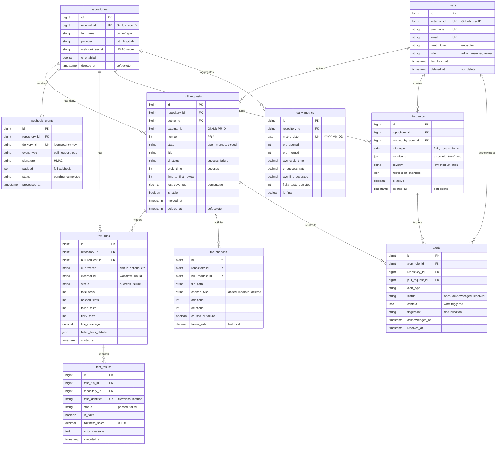

# Database Schema Diagram

## Entity Relationship Diagram



## Table Sizes & Growth


## Query Flow Examples

### Dashboard Overview Query


### Webhook Processing Flow


### Flaky Test Detection Query


## Index Usage Patterns

### Composite Index Examples

```sql
-- Index: idx_pr_repo_state_created (repository_id, state, created_at)
-- Covers these queries efficiently:

-- Query 1: Open PRs for a repo
SELECT * FROM pull_requests 
WHERE repository_id = 1 AND state = 'open' 
ORDER BY created_at DESC;

-- Query 2: Recent merged PRs
SELECT * FROM pull_requests 
WHERE repository_id = 1 AND state = 'merged' 
AND created_at >= DATE_SUB(NOW(), INTERVAL 7 DAY);

-- Query 3: Count by state
SELECT state, COUNT(*) FROM pull_requests 
WHERE repository_id = 1 
GROUP BY state;
```

### JSON Column Querying

```sql
-- Query with generated column (MySQL only)
SELECT * FROM webhook_events 
WHERE repository_id = 123  -- Uses generated column index
AND event_type = 'pull_request';

-- Query without generated column (PlanetScale compatible)
SELECT * FROM webhook_events 
WHERE JSON_EXTRACT(payload, '$.repository.id') = 123
AND event_type = 'pull_request';
-- Note: Slower, but works everywhere
```

## Data Flow Architecture


## Storage Distribution (After 90 Days)

```
Total Database Size: ~9.5 GB

┌─────────────────────────────────────────────────────┐
│ test_results (70%)           6.75 GB                │
│ ███████████████████████████████████████████         │
├─────────────────────────────────────────────────────┤
│ test_runs (14%)              1.35 GB                │
│ ███████                                             │
├─────────────────────────────────────────────────────┤
│ webhook_events (3%)          300 MB                 │
│ ██                                                  │
├─────────────────────────────────────────────────────┤
│ file_changes (3%)            250 MB                 │
│ ██                                                  │
├─────────────────────────────────────────────────────┤
│ pull_requests (2%)           200 MB                 │
│ █                                                   │
├─────────────────────────────────────────────────────┤
│ Other tables (8%)            650 MB                 │
│ ████                                                │
└─────────────────────────────────────────────────────┘

With retention policies (90 days):
  - Old test_results pruned automatically
  - Old webhook_events pruned after 30 days
  - Stays within free-tier 10GB limit
```

## Performance Characteristics

| Operation | Complexity | Typical Time | Optimization |
|-----------|-----------|--------------|--------------|
| Insert PR | O(1) | 5-10ms | Indexed columns |
| Update PR metrics | O(1) | 10-20ms | Direct ID lookup |
| List PRs (paginated) | O(log n) | 20-50ms | Composite index |
| Search PRs | O(log n) | 10-30ms | Meilisearch |
| Insert test_run | O(1) | 10-20ms | Batch inserts |
| Insert 200 test_results | O(n) | 100-200ms | Chunked inserts |
| Calculate flakiness | O(n log n) | 200-500ms | Indexed test_identifier |
| Aggregate daily metrics | O(n) | 1-5 sec | Runs off-peak |
| Dashboard overview | O(1) | 10-20ms | Pre-aggregated |

---

## Migration Commands Reference

```bash
# Fresh migration (WARNING: drops all tables)
docker-compose exec app php artisan migrate:fresh

# Run migrations
docker-compose exec app php artisan migrate

# Rollback last batch
docker-compose exec app php artisan migrate:rollback

# Check migration status
docker-compose exec app php artisan migrate:status

# Seed database with test data
docker-compose exec app php artisan db:seed

# Fresh migration + seed
docker-compose exec app php artisan migrate:fresh --seed

# Create new migration
docker-compose exec app php artisan make:migration create_example_table
```

---

**Last Updated:** 2026-01-23  
**Schema Version:** 1.0  
**Total Tables:** 14  
**Total Indexes:** 87  
**Estimated Size (90 days):** 9.5 GB